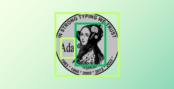

# AdaVisionUnit



## Overview

AdaVisionUnit is a lightweight Ada library designed for testing computer vision pipelines at the data structure level. It provides essential tools for validating object detection annotations, particularly focusing on YOLO format.

## Features

- Bounding box operations (intersection, union, IoU calculations)
- YOLO annotation parsing and validation
- Dataset integrity verification
- Coordinate system conversions (normalized ↔ pixel)
- Comprehensive descriptive statistics for datasets
- Quality assurance tools:
  - Outlier detection
  - Overlapping box detection
  - Class distribution analysis

## Technical Details

- Pure Ada implementation
- No external dependencies
- Modular design with separate packages for bounding box operations and annotations
- Comprehensive test suite with mock data generation

## Statistics Capabilities

The library provides detailed dataset analysis including:
- Object counts and distribution
- Box dimension statistics (min/max/average width, height, area)
- Empty image detection
- Class distribution metrics
- Statistical outlier identification

## Usage Scenarios

- Computer vision dataset validation
- Export batch verification
- Training data quality assurance
- Low-resource deployment (AUVs, Raspberry Pi, embedded systems)
- Automated testing pipelines for vision datasets

## Command-Line Interface

AdaVisionUnit includes `AdaVisionUnit_CLI`, a standalone executable for dataset operations.

Usage:
```
AdaVisionUnit_CLI <command> <annotation_dir> [options]
```
Commands:
- stats `<dir>`                 Print human-readable dataset statistics.
- integrity `<dir>`            Verify dataset integrity (format and value checks).
- export-annotations-csv `<dir>` `<out.csv>`
                                 Export all annotations to CSV.
- export-stats-csv `<dir>` `<out.csv>`
                                 Export dataset statistics to CSV.
- outliers `<dir>`             Report number of statistical outliers.
- overlaps `<dir>`             Report number of overlapping box sets.

Execute with full GNAT path or ensure the executable is on your PATH:
```
gprbuild -P ada_vision_unit.gpr -m ada_vision_unit_cli
bin/ada_vision_unit_cli <command> <dir>
```

## Building with Alire

Install dependencies and build:
```
alr build
```
Or to install locally and run:
```
alr with . --build
```

## Running Tests with Alire

```
alr run ada-vision-unit-test-runner
```

## Using the CLI with Alire

```
alr run ada-vision-unit-cli -- stats <annotation_dir>
```
Additional commands:
```
alr run ada-vision-unit-cli -- evaluate <gt_dir> <pred_dir> [out.csv] [out.json]
```

## Building

```
gprbuild -P ada_vision_unit.gpr
```

## Testing

```
bin/ada_vision_unit_test_runner
```

## License

[Add appropriate license information]
